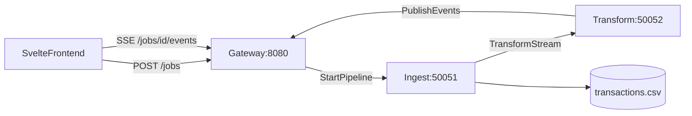

# gRPC Pipeline Demo

Demo didáctica que **compara** un pipeline gRPC con streaming frente a **APIs REST por lotes** (loops desde el browser), usando el mismo CSV y la misma lógica de transformación.

> **Guía para principiantes:** [docs/GUIA_DIDACTICA.md](docs/GUIA_DIDACTICA.md) — explicación didáctica de RPC/gRPC con diagramas Mermaid.  
> **Documentación técnica:** [docs/DESCRIPCION_TECNICA.md](docs/DESCRIPCION_TECNICA.md) — estructura del proyecto, flujos y guía de mantenimiento para desarrolladores.  
> **Presentación:** [presentation/README.md](presentation/README.md) — *Cuando los datos deben fluir entre servicios* (Quarto + reveal.js, autor: César Cárdenas).

## Arquitectura



## Requisitos

- Docker y Docker Compose
- Python 3.11+ (solo para generar proto/CSV en local)

## Inicio rápido

```bash
# Generar stubs gRPC y CSV de ejemplo (local)
python -m venv .venv
.venv/Scripts/pip install -r requirements.txt
.venv/Scripts/python scripts/generate_proto.py
.venv/Scripts/python scripts/generate_sample_csv.py --rows 50000

# Levantar todo el ecosistema
docker compose up --build
```

Abre **http://localhost:5173**:

1. Pestaña **Pipeline gRPC** — diagrama `Ingest → Transform → Gateway`, SSE en vivo
2. Pestaña **API REST por lotes** — loop `GET /records` + `POST /transform` visible en el feed
3. **Tabla comparativa** — tras ejecutar ambos modos, compara tiempo, peticiones y bytes

Observa en gRPC:

- Barra de progreso por **filas** y métricas de **bytes en stream gRPC**
- Throughput dual: filas/s y KB/s
- Feed SSE con previews de registros transformados

## Servicios

| Servicio | Puerto | Rol |
|----------|--------|-----|
| `frontend` | 5173 | UI Svelte |
| `gateway` | 8080 | REST + SSE + gRPC ProgressService |
| `ingest-service` | 50051 | Lee CSV y stream hacia transform |
| `transform-service` | 50052 | Transforma registros y reporta progreso |
| `rest-ingest` | 8091 | GET `/meta`, GET `/records` (lotes CSV) |
| `rest-transform` | 8092 | POST `/transform` (lote JSON) |

## API REST (modo comparación)

**rest-ingest** (`8091`):

- `GET /meta?file_path=` — filas totales y bytes en disco
- `GET /records?offset=&limit=&file_path=` — lote de filas CSV

**rest-transform** (`8092`):

- `POST /transform` — body: `{ "records": [...] }`

## API del gateway (modo gRPC)

- `POST /jobs` — body: `{ "file_path", "chunk_size", "sleep_ms" }`
- `GET /jobs/{id}/events` — SSE de eventos de progreso
- `GET /health` — healthcheck HTTP

## Desarrollo local

Frontend sin Docker:

```bash
cd frontend
npm install
VITE_GATEWAY_URL=http://localhost:8080 \
VITE_REST_INGEST_URL=http://localhost:8091 \
VITE_REST_TRANSFORM_URL=http://localhost:8092 \
npm run dev
```

Smoke tests locales:

```bash
.venv/Scripts/python scripts/smoke_test.py
.venv/Scripts/python scripts/smoke_test_rest.py
```

Regenerar proto tras cambios en `proto/`:

```bash
.venv/Scripts/python scripts/generate_proto.py
```

## Presentación

Slides didácticas sobre gRPC, cuándo usarlo y la demo interactiva. Requiere [Quarto](https://quarto.org/docs/get-started/).

Ver [presentation/README.md](presentation/README.md). Render:

```bash
quarto render presentation/grpc-intro.qmd
python scripts/patch_presentation_html.py
# o
make presentation
```

Verificación visual automatizada (Playwright):

```bash
make presentation-verify
```

## Notas

- El navegador no usa gRPC directamente; el gateway traduce eventos gRPC a SSE.
- `sleep_ms` y **modo lento** en la UI hacen visible el streaming (~2–5 s).
- El CSV demo tiene ~50k filas en `data/transactions.csv`.
- **Bytes en stream** (`bytes_streamed`) mide JSON enviado entre servicios; **bytes en disco** (`total_file_bytes`) es el tamaño del CSV. Son métricas distintas y complementarias.
