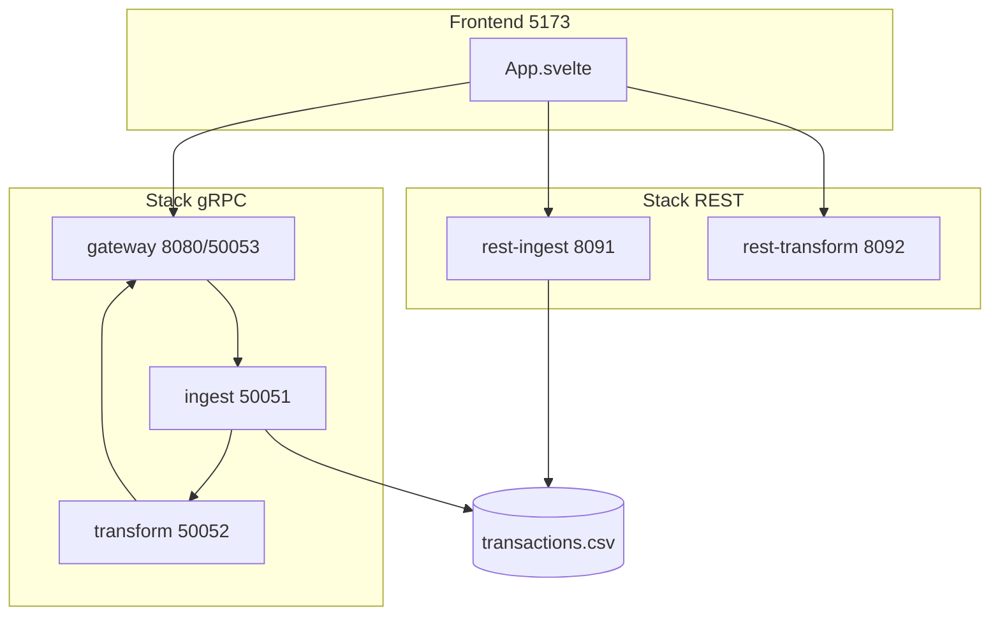
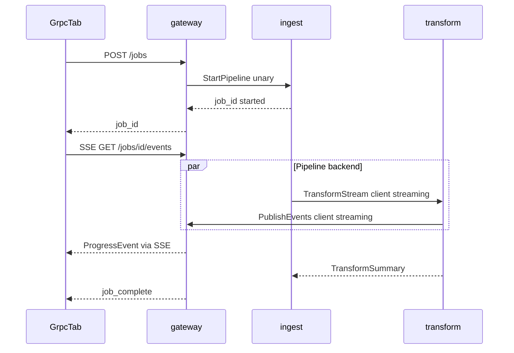
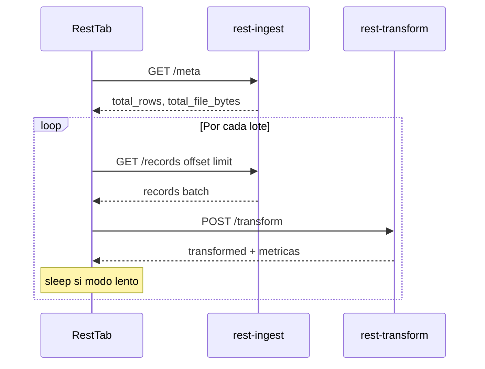
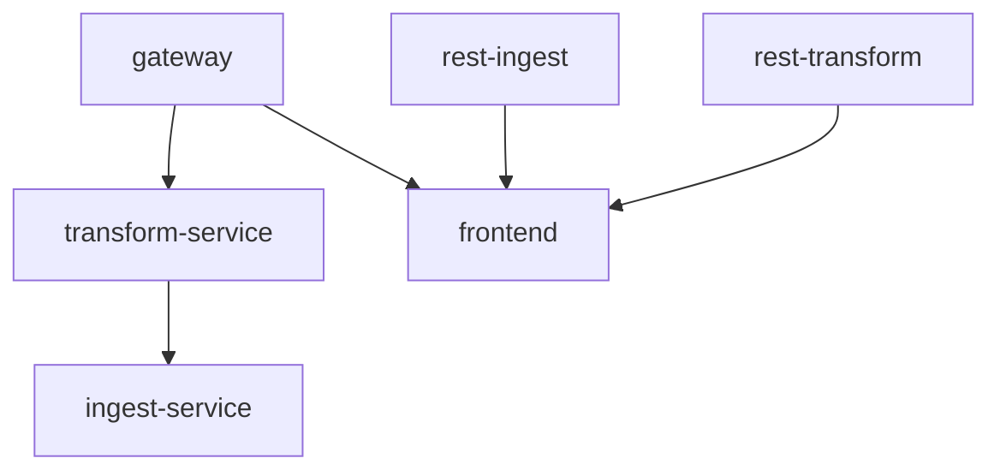

# Descripción técnica — rpc_demo

Documento de mantenimiento para desarrolladores. Explica cómo está organizado el repositorio, cómo fluyen los datos en cada stack y qué archivos tocar para cambios habituales.

> Para conceptos de RPC/gRPC orientados a principiantes, ver [GUIA_DIDACTICA.md](GUIA_DIDACTICA.md).  
> Para arranque rápido, ver [README.md](../README.md).

| Documento | Audiencia | Enfoque |
|-----------|-----------|---------|
| `GUIA_DIDACTICA.md` | Principiantes en RPC | Conceptos, analogías, diagramas didácticos |
| `DESCRIPCION_TECNICA.md` (este) | Desarrolladores | Estructura, flujos, contratos, mantenimiento |

---

## 1. Visión general del sistema

**rpc_demo** es una aplicación de demostración que procesa un CSV grande de transacciones (`data/transactions.csv`) de dos maneras distintas y permite compararlas en la UI:

| Modo | Patrón | Orquestación | Progreso hacia el browser |
|------|--------|--------------|---------------------------|
| **gRPC** | Pipeline con streaming entre contenedores | Backend (Ingest → Transform) | SSE (1 conexión persistente) |
| **REST** | Pull por lotes HTTP/JSON | Frontend (loop `fetch`) | Actualización tras cada lote |

Ambos stacks comparten:

- **Dataset:** [`data/transactions.csv`](../data/transactions.csv)
- **Reglas de negocio:** [`services/common/pipeline_utils.py`](../services/common/pipeline_utils.py) (`transform_record`)
- **Lectura CSV:** [`services/common/csv_batch.py`](../services/common/csv_batch.py)



**Stack tecnológico:**

- Backend: Python 3.12, gRPC, FastAPI, uvicorn
- Frontend: Svelte 5, Vite, TypeScript
- Infra: Docker Compose, red interna `grpc-net`

---

## 2. Mapa del repositorio

```
rpc_demo/
├── proto/pipeline/v1/pipeline.proto   # Contrato gRPC (fuente de verdad)
├── generated/                         # Stubs Python generados (no editar a mano)
├── services/
│   ├── common/                        # CSV + transformación compartida
│   ├── ingest/                        # gRPC: lectura y stream
│   ├── transform/                     # gRPC: transformación y progreso
│   ├── gateway/                       # HTTP/SSE + gRPC ProgressService
│   ├── rest_ingest/                   # REST: meta + records paginados
│   └── rest_transform/                # REST: POST /transform
├── frontend/                          # UI Svelte
├── data/transactions.csv              # Dataset de demo
├── scripts/                           # Generación proto/CSV, smoke tests
├── docs/                              # Documentación
├── docker-compose.yml
├── requirements.txt
└── Makefile
```

| Ruta | Responsabilidad |
|------|-----------------|
| [`proto/pipeline/v1/pipeline.proto`](../proto/pipeline/v1/pipeline.proto) | Servicios y mensajes gRPC |
| [`generated/`](../generated/) | `pipeline_pb2.py`, `pipeline_pb2_grpc.py` — regenerar con script |
| [`services/ingest/server.py`](../services/ingest/server.py) | `IngestService`: lee CSV, client-stream hacia Transform |
| [`services/transform/server.py`](../services/transform/server.py) | `TransformService`: transforma stream, publica `ProgressEvent` |
| [`services/gateway/main.py`](../services/gateway/main.py) | REST API jobs, SSE, `ProgressService` gRPC |
| [`services/rest_ingest/main.py`](../services/rest_ingest/main.py) | `GET /meta`, `GET /records` |
| [`services/rest_transform/main.py`](../services/rest_transform/main.py) | `POST /transform` |
| [`services/common/pipeline_utils.py`](../services/common/pipeline_utils.py) | Tipos de cambio, categorías, umbral `high_value` |
| [`services/common/csv_batch.py`](../services/common/csv_batch.py) | `count_rows`, `file_meta`, `read_batch` |
| [`frontend/src/App.svelte`](../frontend/src/App.svelte) | Pestañas, controles compartidos, historial comparativo |
| [`scripts/generate_proto.py`](../scripts/generate_proto.py) | Genera stubs desde `.proto` |
| [`scripts/smoke_test.py`](../scripts/smoke_test.py) | E2E stack gRPC |
| [`scripts/smoke_test_rest.py`](../scripts/smoke_test_rest.py) | E2E stack REST |

---

## 3. Stack gRPC — flujo técnico

### Secuencia de un job



### Paso a paso (referencias de código)

1. **Frontend** — [`GrpcTab.svelte`](../frontend/src/lib/tabs/GrpcTab.svelte) llama `startJob()` en [`api.ts`](../frontend/src/lib/api.ts) con `chunk_size` y `sleep_ms` (modo lento → 80 ms).
2. **Gateway** — [`main.py`](../services/gateway/main.py):
   - `POST /jobs` → crea `job_id` en `JobHub`, lanza thread que invoca `IngestService.StartPipeline`.
   - `GET /jobs/{id}/events` → SSE desde cola asyncio por suscriptor.
3. **Ingest** — [`server.py`](../services/ingest/server.py):
   - `StartPipeline` arranca thread `_run_pipeline`.
   - Generador lee CSV fila a fila, emite `RawRecord` por `TransformStream`.
   - Pausa cada `chunk_size` filas si `sleep_ms > 0`.
4. **Transform** — [`server.py`](../services/transform/server.py):
   - Recibe stream de `RawRecord`, aplica `transform_record()`.
   - Cada `PROGRESS_EVERY` filas llama `_emit_progress()` → gateway `PublishEvents`.
5. **Gateway** — `ProgressServicer.PublishEvents` publica en `JobHub`; los suscriptores SSE reciben JSON.

### Contratos RPC

Definidos en [`pipeline.proto`](../proto/pipeline/v1/pipeline.proto):

| RPC | Servicio | Tipo | Caller → Callee |
|-----|----------|------|-----------------|
| `StartPipeline` | IngestService | Unary | gateway → ingest |
| `TransformStream` | TransformService | Client streaming | ingest → transform |
| `PublishEvents` | ProgressService | Client streaming | transform → gateway |
| `Ping` | Todos | Unary | healthchecks Docker |

Mensajes relevantes:

- `RawRecord`: fila CSV serializada + `bytes_read` acumulado + metadatos archivo.
- `ProgressEvent`: progreso para UI (filas, USD, bytes stream, throughput).
- `TransformSummary`: totales al cerrar el stream.

---

## 4. Stack REST — flujo técnico

La orquestación ocurre **en el browser**, no en el backend.



### Implementación

- **Cliente loop:** [`restBatchClient.ts`](../frontend/src/lib/restBatchClient.ts) — `runRestBatchPipeline()`.
- **UI:** [`RestTab.svelte`](../frontend/src/lib/tabs/RestTab.svelte).

### Endpoints

**rest-ingest** (puerto 8091) — [`rest_ingest/main.py`](../services/rest_ingest/main.py):

| Método | Ruta | Parámetros | Respuesta clave |
|--------|------|------------|-----------------|
| GET | `/health` | — | `{ status }` |
| GET | `/meta` | `file_path` | `total_rows`, `total_file_bytes`, `response_bytes` |
| GET | `/records` | `offset`, `limit`, `file_path` | `records[]`, `has_more`, `response_bytes` |

**rest-transform** (puerto 8092) — [`rest_transform/main.py`](../services/rest_transform/main.py):

| Método | Ruta | Body | Respuesta clave |
|--------|------|------|-----------------|
| GET | `/health` | — | `{ status }` |
| POST | `/transform` | `{ "records": [...] }` | `transformed[]`, `rows_processed`, `total_usd_delta`, `response_bytes` |

---

## 5. Frontend — arquitectura de componentes

```
frontend/src/
├── App.svelte                 # Pestañas, chunkSize, slowMode, runHistory
├── main.js
├── app.css
└── lib/
    ├── api.ts                 # Gateway: POST /jobs, EventSource SSE
    ├── restBatchClient.ts     # Loop REST + acumulación métricas
    ├── runMetrics.ts          # Tipo RunMetrics, helpers comparativa
    ├── ComparisonPanel.svelte
    ├── PipelineDiagram.svelte       # Diagrama modo gRPC
    ├── RestPipelineDiagram.svelte   # Diagrama modo REST
    └── tabs/
        ├── GrpcTab.svelte
        └── RestTab.svelte
```

### Patrones Svelte 5

- Estado reactivo con `$state` y derivados con `$derived`.
- Props con `$props()`; callback `onComplete(metrics)` hacia `App.svelte`.
- Feed de eventos con `$state.raw` (arrays reasignados, no mutados).

### Variables de entorno (build-time Vite)

| Variable | Default local | Uso |
|----------|---------------|-----|
| `VITE_GATEWAY_URL` | `http://localhost:8080` | Modo gRPC |
| `VITE_REST_INGEST_URL` | `http://localhost:8091` | Modo REST ingest |
| `VITE_REST_TRANSFORM_URL` | `http://localhost:8092` | Modo REST transform |

Definidas en [`docker-compose.yml`](../docker-compose.yml) para el contenedor frontend. Tras cambiarlas en Docker, reconstruir la imagen frontend.

### Controles compartidos

- **Chunk size:** filas por lote (REST) / pausa de emisión (gRPC ingest).
- **Modo lento:** `sleep_ms = 80` entre lotes/chunks; solo para hacer visible la demo.

---

## 6. Configuración y variables de entorno

### Por servicio

| Servicio | Puerto(s) | Variables | Default (Docker) |
|----------|-----------|-----------|------------------|
| gateway | 8080 HTTP, 50053 gRPC | `HTTP_PORT`, `GRPC_PORT`, `INGEST_TARGET`, `DEFAULT_FILE` | `ingest-service:50051`, `/data/transactions.csv` |
| ingest-service | 50051 | `INGEST_PORT`, `TRANSFORM_TARGET`, `PROGRESS_EVERY` | `transform-service:50052`, `50` |
| transform-service | 50052 | `TRANSFORM_PORT`, `GATEWAY_TARGET`, `PROGRESS_EVERY` | `gateway:50053`, `50` |
| rest-ingest | 8091 | `HTTP_PORT`, `DEFAULT_FILE` | `/data/transactions.csv` |
| rest-transform | 8092 | `HTTP_PORT` | — |
| common | — | `HIGH_VALUE_THRESHOLD` | `1000` (USD) |

### Orden de arranque (Docker Compose)



- **transform** espera **gateway** (para publicar progreso).
- **ingest** espera **transform** (destino del stream).
- **frontend** espera gateway + rest-ingest + rest-transform healthy.

### Red y volúmenes

- Red: `grpc-net` (bridge).
- `./data:/data:ro` en gateway, ingest y rest-ingest.
- Solo se exponen al host: **5173**, **8080**, **8091**, **8092**. Puertos gRPC internos (50051–50053) no están mapeados al host.

---

## 7. Contratos gRPC y generación de código

### Fuente de verdad

[`proto/pipeline/v1/pipeline.proto`](../proto/pipeline/v1/pipeline.proto)

### Regenerar stubs (obligatorio tras editar `.proto`)

```bash
python -m venv .venv
.venv/Scripts/pip install -r requirements.txt
.venv/Scripts/python scripts/generate_proto.py
```

El script [`generate_proto.py`](../scripts/generate_proto.py):

1. Invoca `grpc_tools.protoc`.
2. Crea `__init__.py` en `generated/`.
3. Parchea imports en `pipeline_pb2_grpc.py` para usar `generated.pipeline.v1`.

### Imports en Python

En contenedores: `ENV PYTHONPATH=/app`. Patrón de import:

```python
from generated.pipeline.v1 import pipeline_pb2, pipeline_pb2_grpc
from services.common.pipeline_utils import transform_record
```

**No editar** archivos en `generated/` manualmente; se sobrescriben al regenerar.

### Rebuild Docker

Tras cambios en proto o servicios Python:

```bash
docker compose up --build
```

---

## 8. Lógica de negocio compartida

### Transformación — `pipeline_utils.py`

Función central: `transform_record(payload) -> (result, error)`

- Convierte moneda a USD (`EXCHANGE_RATES`).
- Asigna categoría por merchant (`MERCHANT_CATEGORIES`).
- Marca `high_value` si `amount_usd > HIGH_VALUE_THRESHOLD`.

**Consumidores:**

| Servicio | Usa transform_record |
|----------|---------------------|
| transform (gRPC) | Sí |
| rest-transform | Sí |
| ingest (gRPC) | No (solo lee y serializa CSV) |
| rest-ingest | No |

Un cambio en reglas de negocio en `pipeline_utils.py` afecta **ambos modos** automáticamente.

### Lectura CSV — `csv_batch.py`

| Función | Uso |
|---------|-----|
| `count_rows(path)` | Total de filas de datos (sin header) |
| `file_meta(path)` | `{ total_rows, total_file_bytes }` |
| `read_batch(path, offset, limit)` | Paginación offset/limit para REST |

**Ingest gRPC** no usa `read_batch`; itera el CSV completo en un generador. Si cambias el formato del CSV, revisa ambos caminos.

### Dataset

Generación:

```bash
.venv/Scripts/python scripts/generate_sample_csv.py --rows 50000
```

Columnas: `id, amount, currency, merchant, timestamp`.

---

## 9. Métricas y comparativa

### Tipo `RunMetrics`

Definido en [`runMetrics.ts`](../frontend/src/lib/runMetrics.ts):

```typescript
type RunMetrics = {
  mode: 'grpc' | 'rest';
  chunkSize: number;
  slowMode: boolean;
  totalRows: number;
  rowsProcessed: number;
  rowsRejected: number;
  totalUsd: number;
  wallClockMs: number;
  timeToFirstUpdateMs: number;
  requestCount: number;
  bytesTransferred: number;
  throughputRowsPerSec: number;
  throughputBytesPerSec: number;
};
```

### Cómo se calculan

| Campo | gRPC | REST |
|-------|------|------|
| `requestCount` | 1 POST + 1 conexión SSE | 1 meta + 2 × número de lotes |
| `bytesTransferred` | Suma tamaño JSON de cada evento SSE | Suma `response_bytes` de cada respuesta HTTP |
| `timeToFirstUpdateMs` | Primer evento SSE (excl. `connected`) | Tras primer lote GET+POST |
| `wallClockMs` | `performance.now()` inicio → `job_complete` | Inicio loop → fin loop |

Al completar un modo, `App.svelte` guarda la última ejecución por modo en `runHistory` (máx. 2 entradas). [`ComparisonPanel.svelte`](../frontend/src/lib/ComparisonPanel.svelte) muestra diff REST vs gRPC cuando existen ambas.

### Bytes: no confundir métricas

- `bytes_streamed` (gRPC): JSON acumulado enviado Ingest → Transform.
- `total_file_bytes`: tamaño del CSV en disco.
- `bytesTransferred` (UI gRPC): bytes recibidos por SSE en el browser.
- `bytesTransferred` (UI REST): bytes de respuestas HTTP al browser.

---

## 10. Desarrollo local y verificación

### Makefile

| Comando | Acción |
|---------|--------|
| `make proto` | Regenerar stubs gRPC |
| `make data` | Regenerar CSV (~50k filas) |
| `make up` | `docker compose up --build` |
| `make down` | Detener contenedores |
| `make smoke` | Smoke test gRPC local |
| `make smoke-rest` | Smoke test REST local |

### Stack completo con Docker

```bash
docker compose up --build
# UI: http://localhost:5173
```

### Servicios sueltos (sin Docker)

Terminal 1 — gateway:

```bash
set PYTHONPATH=%CD%
python -m services.gateway.main
```

Terminal 2 — transform:

```bash
set PYTHONPATH=%CD%
set GATEWAY_TARGET=localhost:50053
python -m services.transform.server
```

Terminal 3 — ingest:

```bash
set PYTHONPATH=%CD%
set TRANSFORM_TARGET=localhost:50052
python -m services.ingest.server
```

Terminal 4 — rest-ingest:

```bash
set PYTHONPATH=%CD%
set DEFAULT_FILE=data\transactions.csv
python -m services.rest_ingest.main
```

Terminal 5 — rest-transform:

```bash
set PYTHONPATH=%CD%
python -m services.rest_transform.main
```

Terminal 6 — frontend:

```bash
cd frontend
npm install
npm run dev
```

### Smoke tests

```bash
.venv/Scripts/python scripts/smoke_test.py      # gRPC end-to-end
.venv/Scripts/python scripts/smoke_test_rest.py # REST end-to-end
```

Los smoke tests levantan procesos locales, ejecutan un job completo y validan resultados (p. ej. `bytes_streamed > 0` en gRPC).

### Frontend build

```bash
cd frontend && npm run build
```

---

## 11. Recetas de mantenimiento

### Cambios frecuentes

| Objetivo | Archivos a modificar | Notas |
|----------|---------------------|-------|
| Añadir campo a evento de progreso UI | `pipeline.proto` → `generate_proto.py` → `transform/server.py` → `gateway/main.py` `_event_to_dict` → `api.ts` `ProgressEvent` → `GrpcTab.svelte` | Flujo completo proto → SSE → UI |
| Cambiar reglas de transformación | `services/common/pipeline_utils.py` | Afecta gRPC y REST |
| Cambiar frecuencia de eventos gRPC | env `PROGRESS_EVERY`, lógica en `transform/server.py` | Default: cada 50 filas |
| Añadir endpoint REST | `rest_ingest/main.py` o `rest_transform/main.py` + `restBatchClient.ts` + opcional `RestTab.svelte` | CORS ya abierto en FastAPI |
| Cambiar paginación CSV | `csv_batch.py` + tests manuales REST | Ingest gRPC usa iteración completa |
| Nueva métrica comparativa | `runMetrics.ts` + tabs que calculan + `ComparisonPanel.svelte` | |
| Nuevo servicio en Compose | `services/<nombre>/Dockerfile`, `docker-compose.yml`, healthcheck | Copiar patrón de rest_ingest |
| Regenerar dataset | `scripts/generate_sample_csv.py --rows N` | Montar en `/data` |

### Añadir un nuevo campo a `ProgressEvent` (checklist)

1. Añadir campo en [`pipeline.proto`](../proto/pipeline/v1/pipeline.proto) con número único.
2. Ejecutar `scripts/generate_proto.py`.
3. Poblar el campo en `TransformServicer._build_progress_event()` ([`transform/server.py`](../services/transform/server.py)).
4. Serializar en `_event_to_dict()` ([`gateway/main.py`](../services/gateway/main.py)).
5. Extender tipo `ProgressEvent` en [`api.ts`](../frontend/src/lib/api.ts).
6. Mostrar en [`GrpcTab.svelte`](../frontend/src/lib/tabs/GrpcTab.svelte) si aplica.
7. `make smoke` + rebuild Docker.

### Checklist pre-PR

- [ ] Stubs regenerados si hubo cambios en `.proto`
- [ ] `scripts/smoke_test.py` pasa
- [ ] `scripts/smoke_test_rest.py` pasa
- [ ] `npm run build` en frontend sin errores
- [ ] Imágenes Docker reconstruidas si se cambió backend
- [ ] Documentación actualizada si cambió API pública o variables de entorno

---

## 12. Limitaciones conocidas (intencionales)

| Limitación | Motivo |
|------------|--------|
| Browser no usa gRPC directo | gRPC no es nativo en navegadores; gateway traduce a SSE |
| `sleep_ms` / modo lento | Pausa artificial para visualizar la demo |
| Historial comparativo en memoria | Se pierde al recargar la página |
| Sin autenticación | Demo local |
| Jobs gRPC no persistidos | `JobHub` es dict en memoria del gateway |
| `bytes_streamed` ≠ tamaño CSV | Mide JSON en tránsito, no bytes en disco |
| REST re-lee CSV por lote | `read_batch` escanea desde inicio; aceptable para demo (~50k filas) |

No tratar estas limitaciones como bugs salvo que el alcance del proyecto cambie explícitamente.

---

## 13. Referencias

| Recurso | Descripción |
|---------|-------------|
| [README.md](../README.md) | Inicio rápido, puertos, APIs |
| [GUIA_DIDACTICA.md](GUIA_DIDACTICA.md) | Conceptos RPC/gRPC y comparativa didáctica |
| [docker-compose.yml](../docker-compose.yml) | Topología de contenedores |
| [pipeline.proto](../proto/pipeline/v1/pipeline.proto) | Contrato gRPC |

---

*Última revisión alineada con el stack gRPC + REST comparativo y frontend con pestañas.*
