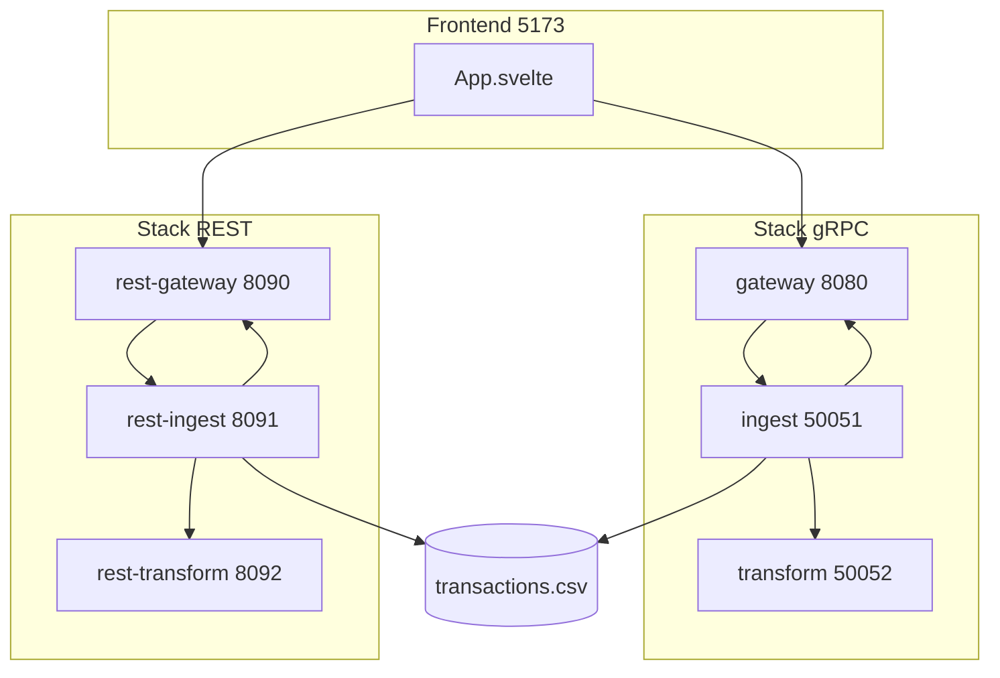
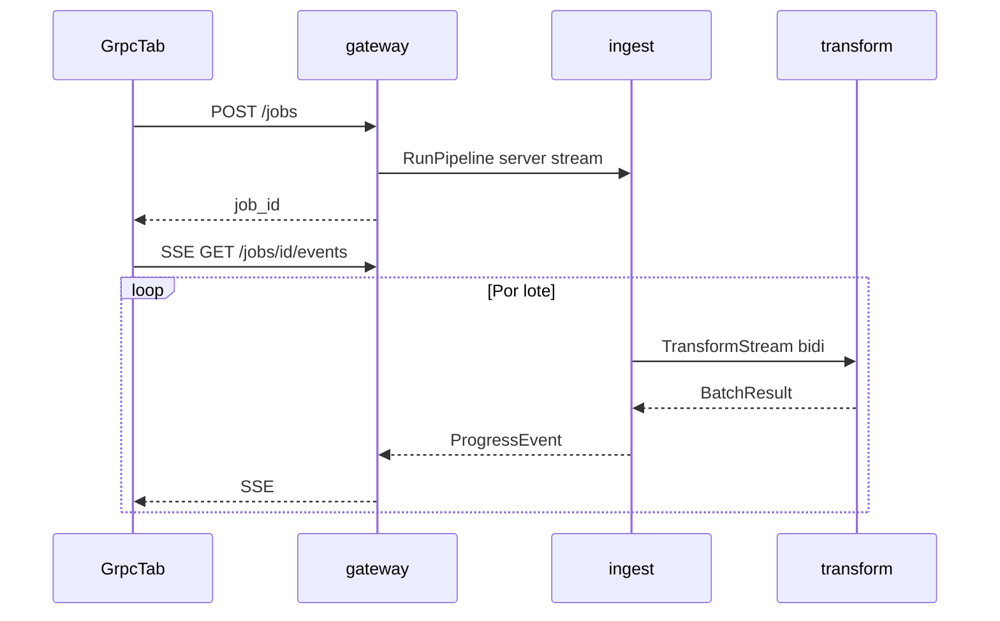
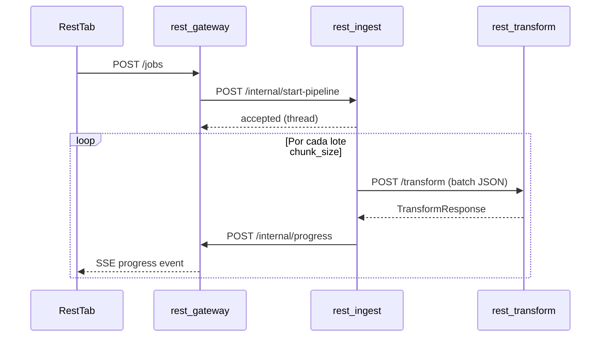
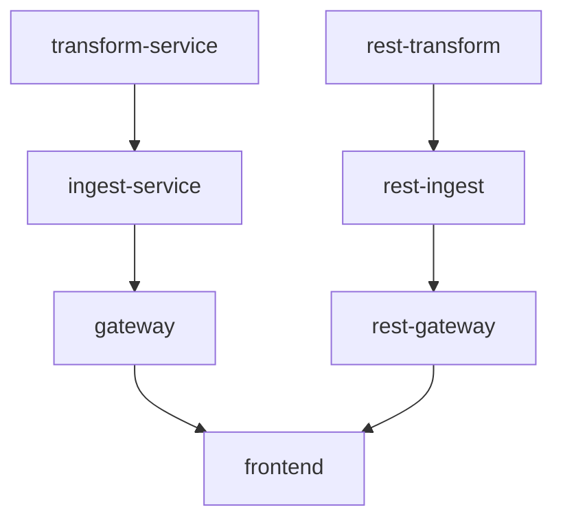

# Descripción técnica — rpc_demo

Documento de mantenimiento para desarrolladores. Explica cómo está organizado el repositorio, cómo fluyen los datos en cada stack y qué archivos tocar para cambios habituales.

> Para conceptos de RPC/gRPC orientados a principiantes, ver [GUIA_DIDACTICA.md](GUIA_DIDACTICA.md).  
> Para arranque rápido, ver [README.md](../README.md).

| Documento | Audiencia | Enfoque |
|-----------|-----------|---------|
| `GUIA_DIDACTICA.md` | Principiantes en RPC | Conceptos, analogías, diagramas didácticos |
| `DESCRIPCION_TECNICA.md` (este) | Desarrolladores | Estructura, flujos, contratos, mantenimiento |

---

## 1. Visión general del sistema

**rpc_demo** es una aplicación de demostración que procesa un CSV grande de transacciones (`data/transactions.csv`) de dos maneras distintas y permite compararlas en la UI:

| Modo | Patrón | Orquestación | Progreso hacia el browser |
|------|--------|--------------|---------------------------|
| **gRPC** | Pipeline con streaming entre contenedores | Backend (Ingest orquesta) | SSE (1 conexión persistente) |
| **REST** | Pipeline HTTP/JSON entre servicios | Backend (rest-ingest orquesta) | SSE (1 conexión persistente) |

Ambos stacks comparten:

- **Dataset:** [`data/transactions.csv`](../data/transactions.csv)
- **Reglas de negocio:** [`services/common/pipeline_utils.py`](../services/common/pipeline_utils.py) (`transform_record`)
- **Lectura CSV:** [`services/common/csv_batch.py`](../services/common/csv_batch.py)



**Stack tecnológico:**

- Backend: Python 3.12, gRPC, FastAPI, uvicorn
- Frontend: Svelte 5, Vite, TypeScript
- Infra: Docker Compose, red interna `grpc-net`

---

## 2. Mapa del repositorio

```
rpc_demo/
├── proto/pipeline/v1/pipeline.proto   # Contrato gRPC (fuente de verdad)
├── generated/                         # Stubs Python generados (no editar a mano)
├── services/
│   ├── common/                        # CSV + transformación compartida
│   ├── ingest/                        # gRPC: orquestador RunPipeline
│   ├── transform/                     # gRPC: worker bidi TransformStream
│   ├── gateway/                       # HTTP/SSE; cliente RunPipeline
│   ├── rest_gateway/                  # REST: jobs, SSE, progreso interno
│   ├── rest_ingest/                   # REST: orquestador start-pipeline
│   └── rest_transform/                # REST: worker POST /transform
├── frontend/                          # UI Svelte
├── data/transactions.csv              # Dataset de demo
├── scripts/                           # Generación proto/CSV, smoke tests
├── docs/                              # Documentación
├── docker-compose.yml
├── requirements.txt
└── Makefile
```

| Ruta | Responsabilidad |
|------|-----------------|
| [`proto/pipeline/v1/pipeline.proto`](../proto/pipeline/v1/pipeline.proto) | Servicios y mensajes gRPC |
| [`generated/`](../generated/) | `pipeline_pb2.py`, `pipeline_pb2_grpc.py` — regenerar con script |
| [`services/ingest/server.py`](../services/ingest/server.py) | `IngestService.RunPipeline`: orquesta CSV, bidi Transform, emite ProgressEvent |
| [`services/transform/server.py`](../services/transform/server.py) | `TransformService`: worker bidi; devuelve BatchResult por lote |
| [`services/gateway/main.py`](../services/gateway/main.py) | REST API jobs, SSE; cliente gRPC RunPipeline |
| [`services/rest_gateway/main.py`](../services/rest_gateway/main.py) | REST API jobs, SSE, `POST /internal/progress` |
| [`services/rest_ingest/main.py`](../services/rest_ingest/main.py) | Orquestador: start-pipeline, POST transform, POST progreso |
| [`services/rest_transform/main.py`](../services/rest_transform/main.py) | Worker: `POST /transform` |
| [`services/common/progress_builder.py`](../services/common/progress_builder.py) | Construcción compartida de ProgressPayload / ProgressEvent |
| [`services/common/pipeline_utils.py`](../services/common/pipeline_utils.py) | Tipos de cambio, categorías, umbral `high_value` |
| [`services/common/csv_batch.py`](../services/common/csv_batch.py) | `iter_csv_batches`, `file_meta`, `count_rows` |
| [`frontend/src/App.svelte`](../frontend/src/App.svelte) | Pestañas, controles compartidos, historial comparativo |
| [`scripts/generate_proto.py`](../scripts/generate_proto.py) | Genera stubs desde `.proto` |
| [`scripts/smoke_test.py`](../scripts/smoke_test.py) | E2E stack gRPC |
| [`scripts/smoke_test_rest.py`](../scripts/smoke_test_rest.py) | E2E stack REST |

---

## 3. Stack gRPC — flujo técnico

### Secuencia de un job



### Paso a paso (referencias de código)

1. **Frontend** — [`GrpcTab.svelte`](../frontend/src/lib/tabs/GrpcTab.svelte) llama `startJob()` en [`api.ts`](../frontend/src/lib/api.ts) con `chunk_size` y `sleep_ms` (modo lento → 80 ms).
2. **Gateway** — [`main.py`](../services/gateway/main.py):
   - `POST /jobs` → crea `job_id` en `JobHub`, lanza thread que consume `IngestService.RunPipeline`.
   - `GET /jobs/{id}/events` → SSE desde cola asyncio por suscriptor.
3. **Ingest** — [`server.py`](../services/ingest/server.py):
   - `RunPipeline` lee CSV por lotes, envía `RecordBatch` por bidi `TransformStream`.
   - Por cada `BatchResult` recibido, emite `ProgressEvent` (`stage=batch` o `complete`).
4. **Transform** — [`server.py`](../services/transform/server.py):
   - Worker puro: recibe `RecordBatch`, devuelve `BatchResult`. Sin contacto con gateway.
5. **Gateway** — [`ingest_client.py`](../services/gateway/ingest_client.py) publica cada evento en `JobHub`.

### Contratos RPC

Definidos en [`pipeline.proto`](../proto/pipeline/v1/pipeline.proto):

| RPC | Servicio | Tipo | Caller → Callee |
|-----|----------|------|-----------------|
| `RunPipeline` | IngestService | Server streaming | gateway → ingest |
| `TransformStream` | TransformService | Bidirectional streaming | ingest ↔ transform |
| `Ping` | Ingest, Transform | Unary | healthchecks Docker |

Mensajes relevantes:

- `TransactionRecord`: fila CSV tipada (`id`, `amount`, `currency`, `merchant`, `timestamp`).
- `RecordBatch`: lote de filas + `bytes_read` acumulado (payload lógico JSON) + metadatos archivo.
- `BatchResult`: resultado del transform por lote (filas, USD delta, preview).
- `ProgressEvent`: progreso para UI (filas, USD, bytes stream, wire bytes, throughput).

---

## 4. Stack REST — flujo técnico

La orquestación ocurre **en el servidor**, igual que en gRPC. El browser solo habla con `rest-gateway`.



### Implementación

- **Cliente UI:** [`api.ts`](../frontend/src/lib/api.ts) — `startJob({ gatewayUrl: REST_GATEWAY_URL })`, `subscribeToJob`.
- **UI:** [`RestTab.svelte`](../frontend/src/lib/tabs/RestTab.svelte).

### Endpoints

**rest-gateway** (puerto 8090) — [`rest_gateway/routes/jobs.py`](../services/rest_gateway/routes/jobs.py):

| Método | Ruta | Body / uso | Respuesta clave |
|--------|------|------------|-----------------|
| GET | `/health` | — | `{ status }` |
| POST | `/jobs` | `file_path`, `chunk_size`, `sleep_ms` | `job_id`, `status` |
| GET | `/jobs/{id}` | — | `status`, `last_event` |
| GET | `/jobs/{id}/events` | SSE | eventos JSON de progreso |
| POST | `/internal/progress` | payload alineado a `ProgressEvent` | `{ ok }` |

**rest-ingest** (puerto 8091) — [`rest_ingest/main.py`](../services/rest_ingest/main.py):

| Método | Ruta | Uso |
|--------|------|-----|
| GET | `/health` | healthcheck |
| POST | `/internal/start-pipeline` | orquesta CSV, transform y POST progreso al gateway |
| GET | `/meta`, `/records` | solo debug (no usa el browser) |

**rest-transform** (puerto 8092) — [`rest_transform/main.py`](../services/rest_transform/main.py):

| Método | Ruta | Body | Respuesta clave |
|--------|------|------|-----------------|
| GET | `/health` | — | `{ status }` |
| POST | `/transform` | `{ "records": [...] }` | resumen del lote |

Ver también [FLUJO_REST_GATEWAY_SSE.md](FLUJO_REST_GATEWAY_SSE.md).

## 5. Frontend — arquitectura de componentes

```
frontend/src/
├── App.svelte                 # Pestañas, chunkSize, slowMode, runHistory
├── main.js
├── app.css
└── lib/
    ├── api.ts                 # Gateway gRPC y REST: POST /jobs, EventSource SSE
    ├── runMetrics.ts          # Tipo RunMetrics, helpers comparativa
    ├── ComparisonPanel.svelte
    ├── PipelineDiagram.svelte       # Diagrama modo gRPC
    ├── RestPipelineDiagram.svelte   # Diagrama modo REST
    └── tabs/
        ├── GrpcTab.svelte
        └── RestTab.svelte
```

### Patrones Svelte 5

- Estado reactivo con `$state` y derivados con `$derived`.
- Props con `$props()`; callback `onComplete(metrics)` hacia `App.svelte`.
- Feed de eventos con `$state.raw` (arrays reasignados, no mutados).

### Variables de entorno (build-time Vite)

| Variable | Default local | Uso |
|----------|---------------|-----|
| `VITE_GATEWAY_URL` | `http://localhost:8080` | Modo gRPC |
| `VITE_REST_GATEWAY_URL` | `http://localhost:8090` | Modo REST equiparable |

Definidas en [`docker-compose.yml`](../docker-compose.yml) para el contenedor frontend. Tras cambiarlas en Docker, reconstruir la imagen frontend.

### Controles compartidos

- **Chunk size:** filas por lote en ambos stacks; un evento SSE por lote.
- **Modo lento:** `sleep_ms = 80` entre lotes/chunks; solo para hacer visible la demo.

---

## 6. Configuración y variables de entorno

### Por servicio

| Servicio | Puerto(s) | Variables | Default (Docker) |
|----------|-----------|-----------|------------------|
| gateway | 8080 HTTP | `HTTP_PORT`, `INGEST_TARGET`, `DEFAULT_FILE` | `ingest-service:50051`, `/data/transactions.csv` |
| ingest-service | 50051 | `INGEST_PORT`, `TRANSFORM_TARGET` | `transform-service:50052` |
| transform-service | 50052 | `TRANSFORM_PORT` | — |
| rest-gateway | 8090 | `HTTP_PORT`, `REST_INGEST_URL`, `DEFAULT_FILE` | `rest-ingest:8091` |
| rest-ingest | 8091 | `HTTP_PORT`, `DEFAULT_FILE`, `REST_TRANSFORM_URL`, `REST_GATEWAY_URL` | `rest-transform:8092`, `rest-gateway:8090` |
| rest-transform | 8092 | `HTTP_PORT` | — |
| common | — | `HIGH_VALUE_THRESHOLD` | `1000` (USD) |

### Orden de arranque (Docker Compose)



- **ingest** espera **transform** (destino bidi stream).
- **gateway** espera **ingest** (cliente RunPipeline).
- **rest-ingest** espera **rest-transform**; publica progreso a **rest-gateway**.
- **frontend** espera gateway y rest-gateway healthy.

### Red y volúmenes

- Red: `grpc-net` (bridge).
- `./data:/data:ro` en gateway, ingest y rest-ingest.
- Solo se exponen al host: **5173**, **8080**, **8090**, **8091**, **8092** (8091/8092 opcionales para debug). Puertos gRPC internos (50051–50052) no están mapeados al host.

---

## 7. Contratos gRPC y generación de código

### Fuente de verdad

[`proto/pipeline/v1/pipeline.proto`](../proto/pipeline/v1/pipeline.proto)

### Regenerar stubs (obligatorio tras editar `.proto`)

```bash
python -m venv .venv
.venv/Scripts/pip install -r requirements.txt
.venv/Scripts/python scripts/generate_proto.py
```

El script [`generate_proto.py`](../scripts/generate_proto.py):

1. Invoca `grpc_tools.protoc`.
2. Crea `__init__.py` en `generated/`.
3. Parchea imports en `pipeline_pb2_grpc.py` para usar `generated.pipeline.v1`.

### Imports en Python

En contenedores: `ENV PYTHONPATH=/app`. Patrón de import:

```python
from generated.pipeline.v1 import pipeline_pb2, pipeline_pb2_grpc
from services.common.pipeline_utils import transform_record
```

**No editar** archivos en `generated/` manualmente; se sobrescriben al regenerar.

### Rebuild Docker

Tras cambios en proto o servicios Python:

```bash
docker compose up --build
```

---

## 8. Lógica de negocio compartida

### Transformación — `pipeline_utils.py`

Función central: `transform_record(payload) -> (result, error)`

- Convierte moneda a USD (`EXCHANGE_RATES`).
- Asigna categoría por merchant (`MERCHANT_CATEGORIES`).
- Marca `high_value` si `amount_usd > HIGH_VALUE_THRESHOLD`.

**Consumidores:**

| Servicio | Usa transform_record |
|----------|---------------------|
| transform (gRPC) | Sí |
| rest-transform | Sí |
| ingest (gRPC) | No (solo lee y serializa CSV) |
| rest-ingest | No |

Un cambio en reglas de negocio en `pipeline_utils.py` afecta **ambos modos** automáticamente.

### Lectura CSV — `csv_batch.py`

| Función | Uso |
|---------|-----|
| `count_rows(path)` | Total de filas de datos (sin header) |
| `file_meta(path)` | `{ total_rows, total_file_bytes }` |
| `iter_csv_batches(path, chunk_size)` | Lectura secuencial por lotes (gRPC ingest y REST pipeline) |
| `read_batch(path, offset, limit)` | Paginación offset/limit (solo debug REST) |

**Ingest gRPC** y **rest-ingest pipeline** usan `iter_csv_batches` (una pasada). Si cambias el formato del CSV, revisa ambos caminos.

### Dataset

Generación:

```bash
.venv/Scripts/python scripts/generate_sample_csv.py --rows 50000
```

Columnas: `id, amount, currency, merchant, timestamp`.

---

## 9. Métricas y comparativa

### Tipo `RunMetrics`

Definido en [`runMetrics.ts`](../frontend/src/lib/runMetrics.ts):

```typescript
type RunMetrics = {
  mode: 'grpc' | 'rest';
  chunkSize: number;
  slowMode: boolean;
  totalRows: number;
  rowsProcessed: number;
  rowsRejected: number;
  totalUsd: number;
  wallClockMs: number;
  timeToFirstUpdateMs: number;
  requestCount: number;
  bytesTransferred: number;
  bytesPipeline: number;
  bytesWirePipeline: number;
  wireBytesPerBatch: number;
  batchCount: number;
  throughputRowsPerSec: number;
  throughputBytesPerSec: number;
};
```

### Cómo se calculan

| Campo | gRPC | REST |
|-------|------|------|
| `requestCount` | 1 POST + 1 conexión SSE | 1 POST + 1 conexión SSE |
| `bytesPipeline` | `bytes_streamed` al `job_complete` (JSON acumulado ingest→transform) | Igual |
| `bytesWirePipeline` | `wire_bytes_total` al `job_complete` (`RecordBatch.ByteSize()` acumulado) | `wire_bytes_total` (suma de `len(body)` HTTP JSON por lote) |
| `wireBytesPerBatch` | `bytesWirePipeline / batchCount` | Igual |
| `batchCount` | `chunk_total` al cerrar el job | Igual |
| `bytesTransferred` | Suma JSON de cada evento SSE (solo pestaña/diagrama) | Igual |
| `throughputBytesPerSec` | `bytesPipeline / wallClockMs` | Igual |
| `timeToFirstUpdateMs` | Primer evento SSE (excl. `connected`) | Igual |
| `wallClockMs` | `performance.now()` inicio → `job_complete` | Igual |

Al completar un modo, `App.svelte` guarda la última ejecución por modo en `runHistory` (máx. 2 entradas). [`ComparisonPanel.svelte`](../frontend/src/lib/ComparisonPanel.svelte) separa:

- **Contexto común** (una columna): chunk, filas, lotes, peticiones HTTP browser, payload lógico.
- **Tabla diferencial**: tiempos, throughput filas/s, bytes wire total y promedio por lote.

### Bytes: no confundir métricas

- `bytesPipeline` / `bytes_streamed`: payload lógico JSON de filas entre ingest y transform; **igual en ambos modos** con la misma config.
- `bytesWirePipeline` / `wire_bytes_total`: bytes serializados ingest→transform. **gRPC**: `RecordBatch.ByteSize()` con `TransactionRecord` tipado; **REST**: body JSON HTTP. KPI comparativo de eficiencia de serialización.
- `wire_bytes_batch`: tamaño del lote actual en el wire (eventos de progreso y diagramas).
- `batchCount` / `chunk_total`: número de lotes `ceil(total_rows / chunk_size)`.
- `total_file_bytes`: tamaño del CSV en disco.
- `bytesTransferred` (UI): bytes SSE al navegador; no se usa en la tabla comparativa.

---

## 10. Desarrollo local y verificación

### Makefile

| Comando | Acción |
|---------|--------|
| `make proto` | Regenerar stubs gRPC |
| `make data` | Regenerar CSV (~50k filas) |
| `make up` | `docker compose up --build` |
| `make down` | Detener contenedores |
| `make smoke` | Smoke test gRPC local |
| `make smoke-rest` | Smoke test REST local |

### Stack completo con Docker

```bash
docker compose up --build
# UI: http://localhost:5173
```

### Servicios sueltos (sin Docker)

Terminal 1 — transform:

```bash
set PYTHONPATH=%CD%
python -m services.transform.server
```

Terminal 2 — ingest:

```bash
set PYTHONPATH=%CD%
set TRANSFORM_TARGET=localhost:50052
python -m services.ingest.server
```

Terminal 3 — gateway:

```bash
set PYTHONPATH=%CD%
set INGEST_TARGET=localhost:50051
python -m services.gateway.main
```

Terminal 4 — rest-transform:

```bash
set PYTHONPATH=%CD%
python -m services.rest_transform.main
```

Terminal 5 — rest-ingest:

```bash
set PYTHONPATH=%CD%
set DEFAULT_FILE=data\transactions.csv
set REST_TRANSFORM_URL=http://localhost:8092
set REST_GATEWAY_URL=http://localhost:8090
python -m services.rest_ingest.main
```

Terminal 6 — rest-gateway:

```bash
set PYTHONPATH=%CD%
set REST_INGEST_URL=http://localhost:8091
set DEFAULT_FILE=data\transactions.csv
python -m services.rest_gateway.main
```

Terminal 7 — frontend:

```bash
cd frontend
npm install
npm run dev
```

### Smoke tests

```bash
.venv/Scripts/python scripts/smoke_test.py      # gRPC end-to-end
.venv/Scripts/python scripts/smoke_test_rest.py # REST end-to-end
```

Los smoke tests levantan procesos locales, ejecutan un job completo y validan resultados (p. ej. `bytes_streamed > 0`, `wire_bytes_total > 0` y en gRPC `wire_bytes_total < bytes_streamed`).

### Frontend build

```bash
cd frontend && npm run build
```

---

## 11. Recetas de mantenimiento

### Cambios frecuentes

| Objetivo | Archivos a modificar | Notas |
|----------|---------------------|-------|
| Añadir campo a evento de progreso UI | `pipeline.proto` → `generate_proto.py` → `transform/server.py` → `gateway/main.py` `_event_to_dict` → `api.ts` `ProgressEvent` → `GrpcTab.svelte` | Flujo completo proto → SSE → UI |
| Cambiar reglas de transformación | `services/common/pipeline_utils.py` | Afecta gRPC y REST |
| Cambiar frecuencia de eventos gRPC | `chunk_size` en POST /jobs, lógica en `transform/server.py` | Un evento SSE por lote de `chunk_size` filas |
| Añadir endpoint REST | `rest_gateway/`, `rest_ingest/main.py` o `rest_transform/main.py` + `api.ts` si afecta al browser | CORS ya abierto en FastAPI |
| Cambiar lectura CSV por lotes | `csv_batch.py` (`iter_csv_batches`) | Afecta gRPC ingest y REST pipeline |
| Nueva métrica comparativa | `runMetrics.ts` + tabs que calculan + `ComparisonPanel.svelte` | |
| Nuevo servicio en Compose | `services/<nombre>/Dockerfile`, `docker-compose.yml`, healthcheck | Copiar patrón de rest_ingest |
| Regenerar dataset | `scripts/generate_sample_csv.py --rows N` | Montar en `/data` |

### Añadir un nuevo campo a `ProgressEvent` (checklist)

1. Añadir campo en [`pipeline.proto`](../proto/pipeline/v1/pipeline.proto) con número único.
2. Ejecutar `scripts/generate_proto.py`.
3. Poblar el campo en `TransformServicer._build_progress_event()` ([`transform/server.py`](../services/transform/server.py)).
4. Serializar en `_event_to_dict()` ([`gateway/main.py`](../services/gateway/main.py)).
5. Extender tipo `ProgressEvent` en [`api.ts`](../frontend/src/lib/api.ts).
6. Mostrar en [`GrpcTab.svelte`](../frontend/src/lib/tabs/GrpcTab.svelte) si aplica.
7. `make smoke` + rebuild Docker.

### Checklist pre-PR

- [ ] Stubs regenerados si hubo cambios en `.proto`
- [ ] `scripts/smoke_test.py` pasa
- [ ] `scripts/smoke_test_rest.py` pasa
- [ ] `npm run build` en frontend sin errores
- [ ] Imágenes Docker reconstruidas si se cambió backend
- [ ] Documentación actualizada si cambió API pública o variables de entorno

---

## 12. Limitaciones conocidas (intencionales)

| Limitación | Motivo |
|------------|--------|
| Browser no usa gRPC directo | gRPC no es nativo en navegadores; gateway traduce a SSE |
| `sleep_ms` / modo lento | Pausa artificial para visualizar la demo |
| Historial comparativo en memoria | Se pierde al recargar la página |
| Sin autenticación | Demo local |
| Jobs no persistidos | `JobHub` en memoria (gateway y rest-gateway) |
| `bytes_streamed` ≠ tamaño CSV | Mide JSON en tránsito ingest→transform, no bytes en disco |
| Tamaño máximo de lote gRPC | `MAX_CHUNK_SIZE` (80k filas) requiere `MAX_GRPC_MESSAGE_BYTES` (64 MiB) en canales/servidores gRPC; el default de gRPC es 4 MiB y rompe lotes grandes |

Los límites de mensaje se centralizan en [`services/common/limits.py`](../services/common/limits.py) (`grpc_message_options()`) y se aplican en ingest, transform y gateway gRPC.

No tratar estas limitaciones como bugs salvo que el alcance del proyecto cambie explícitamente.

---

## 13. Referencias

| Recurso | Descripción |
|---------|-------------|
| [README.md](../README.md) | Inicio rápido, puertos, APIs |
| [GUIA_DIDACTICA.md](GUIA_DIDACTICA.md) | Conceptos RPC/gRPC y comparativa didáctica |
| [docker-compose.yml](../docker-compose.yml) | Topología de contenedores |
| [pipeline.proto](../proto/pipeline/v1/pipeline.proto) | Contrato gRPC |

---

*Última revisión alineada con el stack gRPC + REST comparativo y frontend con pestañas.*
