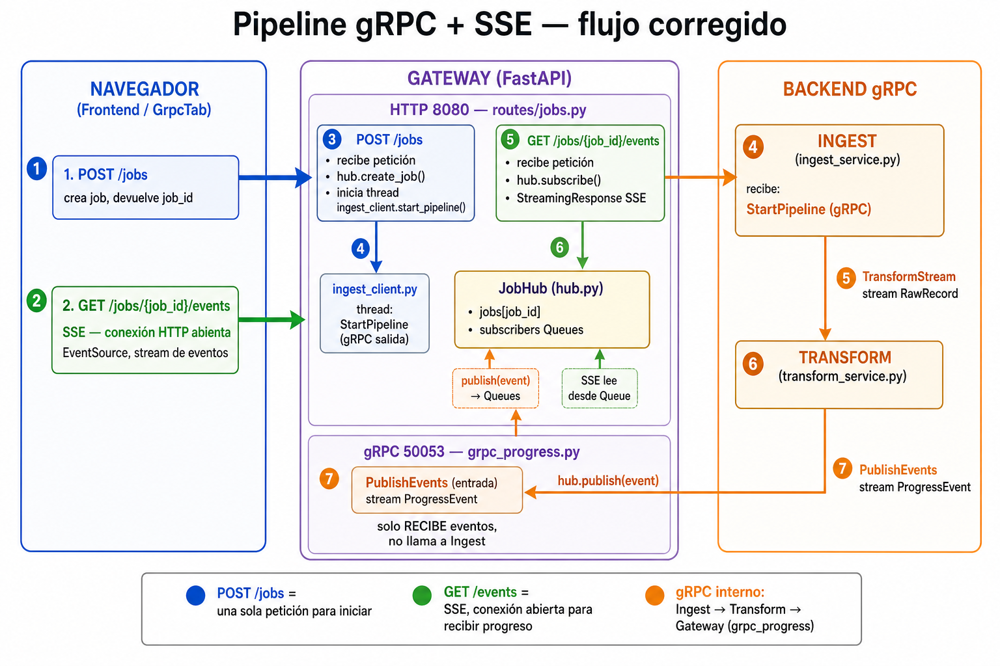

# Flujo del gateway: REST, SSE y gRPC

Este documento describe el diagrama del pipeline en modo gRPC y cómo el gateway traduce eventos internos hacia el navegador.



## Qué representa el diagrama

El demo combina **dos tipos de comunicación**:

| Canal | Participantes | Rol |
|-------|---------------|-----|
| **HTTP** (REST + SSE) | Navegador ↔ Gateway | Lo que ve y usa el frontend |
| **gRPC** | Gateway ↔ Ingest ↔ Transform | Comunicación entre servicios backend |

El navegador **no habla gRPC directamente**. El gateway consume el stream `RunPipeline` de Ingest y reenvía cada evento al UI por **SSE** (Server-Sent Events).

## Paso 1 — El frontend inicia el job (una sola POST)

El usuario pulsa ejecutar en `GrpcTab.svelte`. El frontend hace **una única** petición:

```
POST /jobs
Body: { file_path, chunk_size, sleep_ms }
```

**Respuesta:** `{ job_id, status }`

En el servidor, `routes/jobs.py`:

1. `hub.create_job()` genera un `job_id` (UUID) y lo registra en memoria.
2. Arranca un thread con `ingest_client.run_pipeline(hub, loop, job_id, ...)`.
3. Devuelve el `job_id` al navegador.

**Importante:** aquí **no** hay SSE ni gRPC hacia el navegador. Solo se crea el job y se dispara el pipeline en background.

## Paso 2 — El frontend abre SSE (GET, conexión abierta)

Inmediatamente después del POST, el frontend abre **una conexión GET distinta**:

```
GET /jobs/{job_id}/events
```

En el cliente se usa `EventSource` (`frontend/src/lib/api.ts`). Es **SSE**: la petición HTTP **no se cierra**; el servidor sigue enviando líneas `data: {...}` mientras hay eventos.

En `routes/jobs.py`:

1. `hub.subscribe(job_id)` crea una `asyncio.Queue` y la agrega a `job.subscribers`.
2. `StreamingResponse` con `media_type="text/event-stream"` mantiene la conexión abierta.
3. El generador `event_stream()` hace `await queue.get()` y escribe cada evento al stream.

**No es un segundo POST.** Son dos peticiones HTTP de distinto tipo: primero POST (crear), luego GET (escuchar).

## Paso 3 — Gateway consume RunPipeline (gRPC server stream)

El thread lanzado en el POST ejecuta `ingest_client.run_pipeline()`:

```
Gateway (ingest_client)  --gRPC RunPipeline-->  Ingest
         <-- stream ProgressEvent --
```

Lleva el mismo `job_id` que creó el hub. Por cada lote completado, Ingest emite un `ProgressEvent`; el gateway publica en el hub vía `asyncio.run_coroutine_threadsafe`.

**Quién llama a Ingest:** `routes/jobs.py` → `ingest_client.py`.

## Paso 4 — Ingest orquesta lectura y transformación

Ingest lee el CSV por lotes y coordina el pipeline:

```
Ingest  --gRPC TransformStream (bidi)-->  Transform
        RecordBatch  -->  BatchResult
```

Por cada lote: lee CSV → envía `RecordBatch` → recibe `BatchResult` → acumula métricas → emite `ProgressEvent` (`stage=batch` o `stage=complete`).

Transform es un **worker puro**: no conoce al gateway ni al frontend.

## Paso 5 — JobHub distribuye el evento

`hub.py` busca el job por `event.job_id` en el diccionario `_jobs`:

1. Actualiza `last_event` y `status` (`running` o `complete`).
2. Pone el payload en **todas** las colas de `job.subscribers`.

El hub no sabe IPs ni sockets del navegador. Solo entrega a las **Queues** registradas cuando algún cliente abrió SSE para ese `job_id`.

## Paso 6 — SSE entrega el evento al navegador

El endpoint `GET /jobs/{job_id}/events` lee de su Queue:

```
data: {"stage":"batch","rows_processed":100,...}
```

El `EventSource` del frontend recibe cada mensaje y `GrpcTab` actualiza la UI. Cuando llega un evento con `job_complete: true`, el stream termina y la conexión SSE se cierra.

## Resumen del `job_id`

El mismo `job_id` viaja por todo el pipeline:

```
POST /jobs (gateway crea UUID)
    → RunPipeline (gateway ← ingest stream)
    → TransformStream (ingest ↔ transform bidi)
    → hub.publish (por job_id)
    → SSE GET /jobs/{job_id}/events
```

## Endpoints HTTP del gateway (referencia)

| Método | Ruta | Tipo | Uso |
|--------|------|------|-----|
| `POST` | `/jobs` | REST | Crear job y arrancar pipeline |
| `GET` | `/jobs/{job_id}` | REST | Snapshot del estado (polling; usa el smoke test) |
| `GET` | `/jobs/{job_id}/events` | **SSE** | Stream en vivo hacia el navegador |

## Archivos clave en el código

| Archivo | Responsabilidad |
|---------|-----------------|
| `services/gateway/routes/jobs.py` | POST, GET snapshot, GET SSE |
| `services/gateway/hub.py` | Registro de jobs y fan-out a suscriptores |
| `services/gateway/ingest_client.py` | Cliente gRPC: consume `RunPipeline` |
| `services/ingest/server.py` | Orquestador: CSV + TransformStream + ProgressEvent |
| `services/transform/server.py` | Worker: bidi TransformStream |
| `services/common/progress_builder.py` | Construcción compartida de eventos de progreso |
| `frontend/src/lib/api.ts` | `startJob()` + `subscribeToJob()` (EventSource) |

## Lectura relacionada

- [GUIA_DIDACTICA.md](GUIA_DIDACTICA.md) — recorrido didáctico del demo.
- [DESCRIPCION_TECNICA.md](DESCRIPCION_TECNICA.md) — detalle técnico del repositorio.
