# Guía didáctica: entender RPC y gRPC con este ejemplo

Esta guía explica **qué es RPC**, **qué aporta gRPC** y **cómo funciona la demo** de este repositorio, pensando en alguien que nunca ha trabajado con comunicación entre servicios.

---

## 1. El problema que resuelve RPC

Imagina una aplicación dividida en varios programas que corren por separado (en contenedores, servidores distintos, etc.). Cada uno tiene una tarea concreta. Para colaborar, **tienen que hablarse**.

La forma más directa sería: “llama a esta función remota como si estuviera en tu mismo proceso”. Eso es la idea central de **RPC** (*Remote Procedure Call* — llamada a procedimiento remoto).

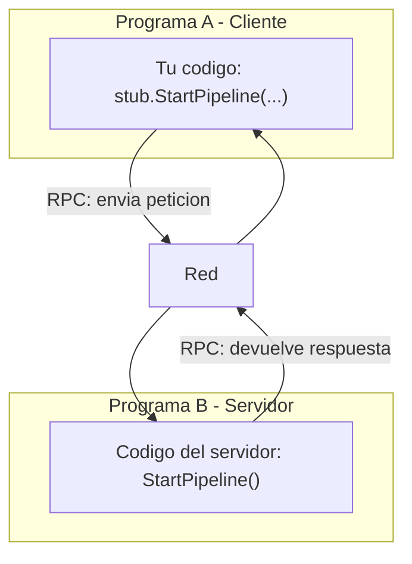

En la práctica, el cliente **no llama una función Python/Go real del otro proceso**. En su lugar, usa un **stub** (código generado) que:

1. Empaqueta los datos en un mensaje estándar.
2. Los envía por la red al servidor.
3. Espera la respuesta y la convierte de nuevo en objetos de tu lenguaje.

Para ti, la experiencia se parece a llamar una función local.

---

## 2. RPC frente a una API REST habitual

Si ya conoces HTTP con JSON (REST), esta comparación ayuda:

| Aspecto | REST típico (HTTP + JSON) | gRPC (RPC moderno) |
|---------|----------------------------|---------------------|
| Contrato | Documentación OpenAPI, a veces informal | Archivo `.proto` estricto y versionable |
| Formato | Texto JSON (legible, más pesado) | Binario Protocol Buffers (compacto, rápido) |
| Modelo mental | Recursos (`GET /users/1`) | Procedimientos/servicios (`GetUser`, `StartPipeline`) |
| Streaming | Posible pero no es lo habitual | Tipos de stream nativos (cliente, servidor, bidireccional) |
| Uso típico | APIs públicas, navegadores | Comunicación **entre servicios** en backend |

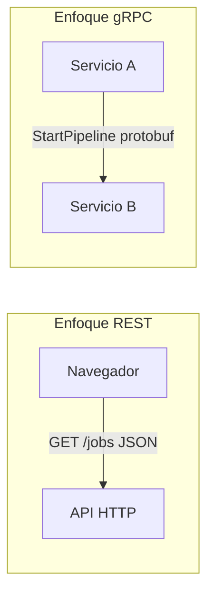

**Importante para esta demo:** el navegador **no habla gRPC directamente**. Por eso existe un **gateway** que traduce entre HTTP (familiar para el frontend) y gRPC (eficiente entre servicios backend).

---

## 3. Qué es gRPC en una frase

**gRPC** es un framework de RPC creado por Google que usa:

- **Protocol Buffers (protobuf)** para definir mensajes y servicios en archivos `.proto`.
- **HTTP/2** como transporte (multiplexación, eficiente).
- **Código generado** en muchos lenguajes (Python, Go, Java, etc.) a partir del `.proto`.

El contrato de nuestra demo está en [`proto/pipeline/v1/pipeline.proto`](../proto/pipeline/v1/pipeline.proto).

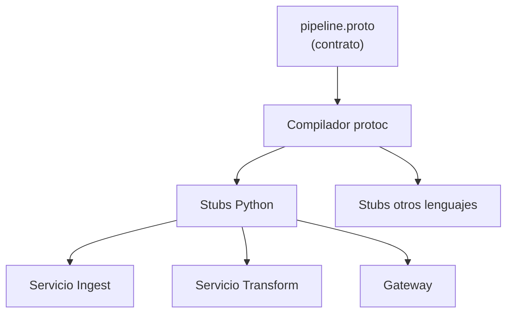

El `.proto` es como un **contrato firmado** entre equipos: si cambias un campo, todos los servicios deben regenerar su código y adaptarse.

---

## 4. Los tres tipos de llamada gRPC (con analogías)

gRPC no solo envía “una petición → una respuesta”. También soporta **streams** (flujos continuos de mensajes).

### 4.1 Unary (una ida, una vuelta)

Como una pregunta concreta y una respuesta concreta.

> *“¿Puedes iniciar el pipeline con este archivo?” → “Sí, job_id = abc-123”*

En nuestra demo: `StartPipeline`.

### 4.2 Client streaming (el cliente envía muchos mensajes)

El cliente manda una secuencia; el servidor responde **una vez** al final.

> *Como entregar una caja con 50 000 fichas, una a una, y al terminar recibir el resumen total.*

En nuestra demo: `TransformStream` — **Ingest** envía miles de `RawRecord` y **Transform** devuelve un `TransformSummary`.

### 4.3 Server streaming (el servidor envía muchos mensajes)

Una petición inicial y luego el servidor va emitiendo resultados.

> *Como pedir “empezar a transmitir el partido” y recibir jugada tras jugada.*

En variantes de la demo se usaría así; aquí el progreso hacia la UI usa otro canal (SSE), pero el concepto es el mismo.

### 4.4 Resumen visual

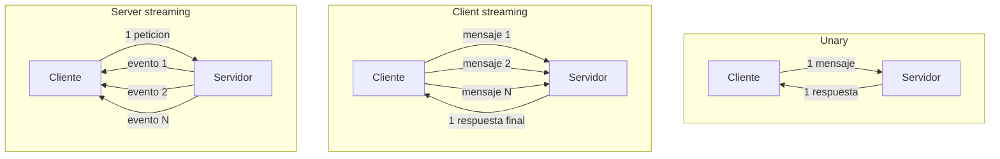

---

## 5. La historia de nuestra demo

**Escenario:** procesar un archivo CSV enorme de transacciones bancarias (~50 000 filas) sin cargarlo entero en memoria ni bloquear la interfaz.

**Actores:**

| Componente | Rol en la historia |
|------------|-------------------|
| **Frontend (Svelte)** | Pantalla donde el usuario pulsa “Iniciar pipeline” y ve el progreso |
| **Gateway** | Puerta HTTP/SSE hacia el navegador; cliente gRPC de `RunPipeline` |
| **Ingest** | Orquesta: lee CSV, coordina Transform, emite progreso al gateway |
| **Transform** | Worker: convierte monedas, clasifica comercios, marca alto valor |
| **transactions.csv** | Archivo de datos de ejemplo montado en el contenedor |

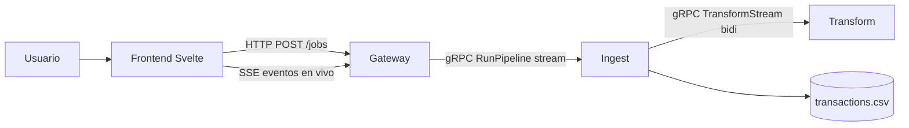

---

## 6. Paso a paso: qué ocurre al pulsar “Iniciar pipeline”

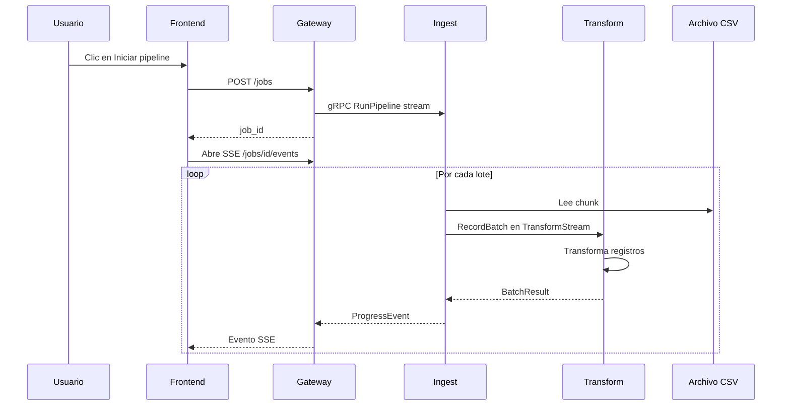

### Paso 1 — El frontend pide un trabajo

El navegador hace `POST /jobs` con parámetros como:

- `chunk_size`: tamaño de **lote** para eventos de progreso hacia la UI (y pausa entre lotes en modo demo con `sleep_ms`).
- `sleep_ms`: retardo artificial para **ver** el streaming en pantalla.

El gateway genera un `job_id` único.

### Paso 2 — El gateway consume RunPipeline (gRPC server stream)

```text
RunPipeline(job_id, file_path, chunk_size, sleep_ms)
         ↓
stream ProgressEvent (por lote completado)
```

El gateway mantiene el stream abierto en un thread de background mientras Ingest orquesta el pipeline.

### Paso 3 — Ingest streama lotes a Transform (bidi streaming)

Por cada lote de `chunk_size` filas, Ingest crea un `RecordBatch`:

```text
RecordBatch {
  job_id,
  chunk_index, chunk_total,
  records: [ TransactionRecord { id, amount, currency, merchant, timestamp }, ... ],
  bytes_read,
  total_rows_estimate,
  total_file_bytes
}
```

Los envía por `TransformStream` (bidireccional) y recibe un `BatchResult` por lote.

### Paso 4 — Transform enriquece (worker puro)

Por cada registro en el lote, Transform:

1. Convierte la moneda a USD (tipos de cambio fijos en la demo).
2. Asigna categoría al comercio (retail, food, etc.).
3. Marca `high_value` si supera un umbral.

Devuelve `BatchResult` a Ingest. **No** contacta al gateway.

### Paso 5 — Ingest emite progreso al gateway

Tras cada lote (lectura + transform), Ingest envía un `ProgressEvent` en el stream `RunPipeline`:

```text
ProgressEvent {
  stage: "batch" | "complete",
  rows_processed, rows_rejected, total_usd,
  bytes_streamed,
  total_file_bytes,
  throughput_rows_per_sec,
  throughput_bytes_per_sec,
  job_complete
}
```

### Dos formas de medir el progreso (filas vs bytes)

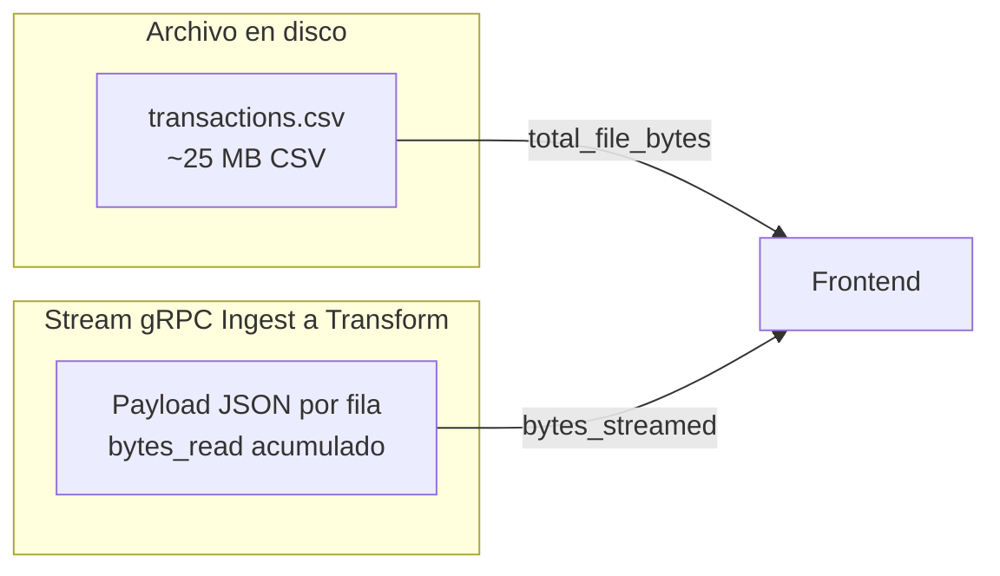

| Métrica | Qué mide | Para qué sirve en la demo |
|---------|----------|---------------------------|
| **Filas** | Registros procesados / estimados | Progreso de negocio; barra principal en la UI |
| **Bytes en disco** | `stat()` del CSV | Contexto de “archivo grande” (~25 MB) |
| **Bytes en stream** | Suma del JSON enviado por gRPC | Ilustra volumen de datos **viajando entre contenedores** |

Los bytes en stream serán **menores** que el archivo en disco (no incluyen cabecera CSV ni formato original). Por eso la UI muestra ambos con etiquetas distintas, sin reemplazar la barra de progreso por filas.

### Paso 5 — El gateway traduce gRPC → SSE → UI

El navegador no entiende gRPC, pero sí **SSE** (*Server-Sent Events*): una conexión HTTP donde el servidor empuja eventos de texto.

El frontend actualiza:

- Barra de progreso (% por **filas**).
- Throughput (filas/s y KB/s o MB/s del stream gRPC).
- Contador de datos en stream vs tamaño del archivo en disco.
- Suma acumulada en USD.
- Feed con preview del último registro transformado.
- Diagrama animado `Ingest → Transform → Gateway/UI` (arista Ingest→Transform muestra bytes streamados).

---

## 7. Por qué hay un Gateway (idea clave)

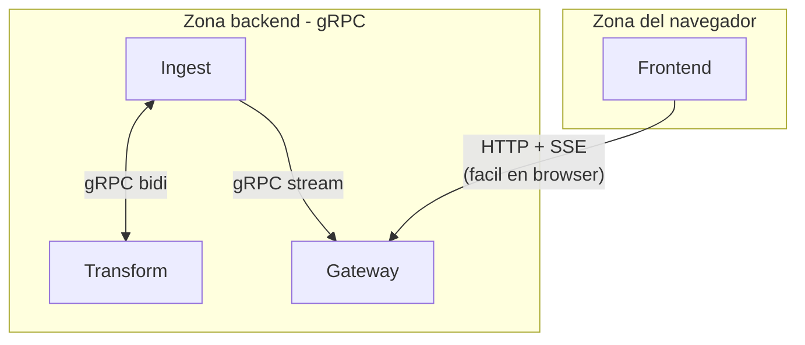

| Capa | Protocolo | Motivo |
|------|-----------|--------|
| Frontend ↔ Gateway | HTTP, JSON, SSE | Estándar web, sin plugins |
| Gateway ↔ Ingest/Transform | gRPC + protobuf | Rápido, tipado, streaming nativo |

El gateway cumple dos roles:

1. **API REST** para iniciar jobs y consultar estado.
2. **Cliente gRPC** de `RunPipeline`: recibe eventos de Ingest y los reenvía al navegador por SSE.

---

## 8. Los servicios gRPC definidos en el contrato

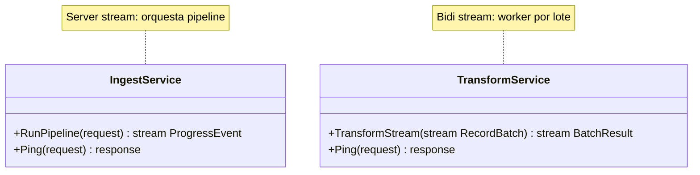

| Servicio | Método | Tipo RPC | Quién llama a quién |
|----------|--------|----------|---------------------|
| `IngestService` | `RunPipeline` | Server streaming | Gateway → Ingest |
| `TransformService` | `TransformStream` | Bidirectional streaming | Ingest ↔ Transform |

Los métodos `Ping` existen para **healthchecks**: Docker verifica que cada contenedor responde antes de considerarlo listo.

---

## 9. Contenedores: un ecosistema aislado

Cada servicio corre en su propio contenedor, conectados por una red interna `grpc-net`.

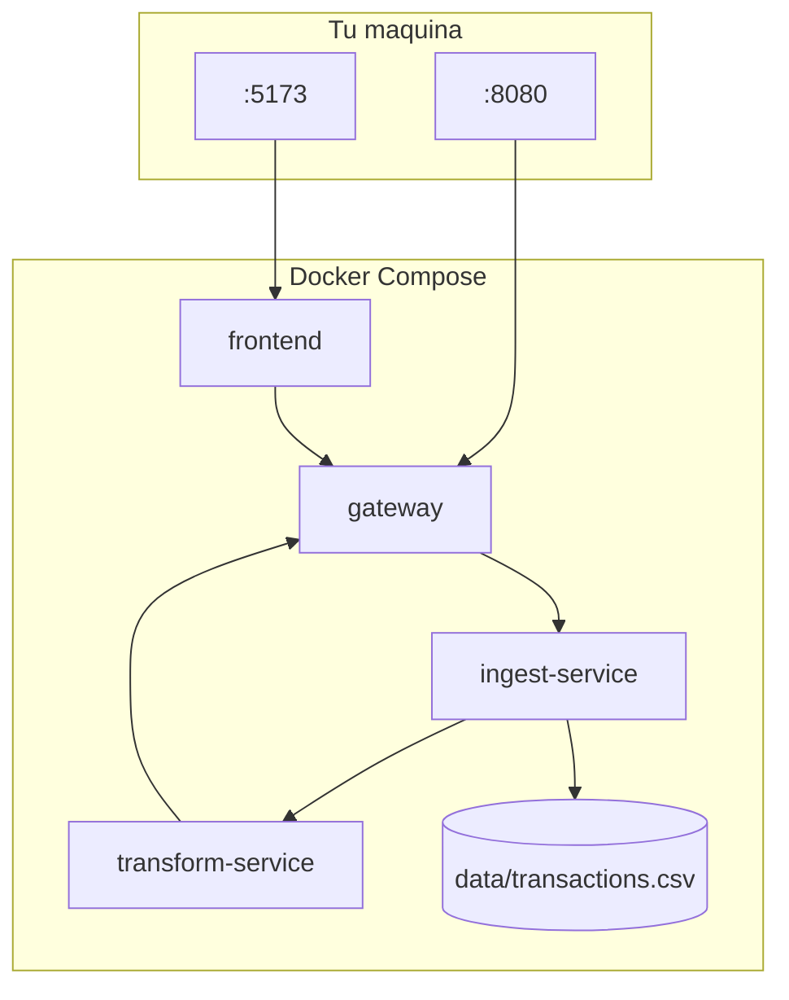

Solo **frontend** y **gateway** exponen puertos al exterior. Ingest y Transform son **internos**: hablan gRPC entre ellos sin ser accesibles directamente desde tu navegador. Eso refuerza el modelo de microservicios.

Orden de arranque (simplificado):

1. Gateway (debe estar listo para recibir progreso).
2. Transform (depende del gateway).
3. Ingest (depende de transform).
4. Frontend (depende del gateway).

---

## 10. Qué transforma exactamente el servicio Transform

Ejemplo de fila de entrada (CSV):

```text
id,amount,currency,merchant,timestamp
TXN-000001,152.30,EUR,Amazon,2024-01-01T00:03:00
```

Después de transformar (conceptualmente):

```json
{
  "id": "TXN-000001",
  "amount_usd": 164.48,
  "category": "retail",
  "merchant": "Amazon",
  "high_value": false,
  "original_currency": "EUR",
  "original_amount": 152.30
}
```

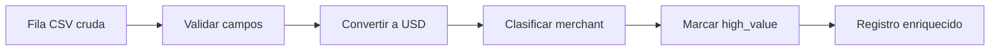

La UI muestra estos resultados en el feed en tiempo real, no el CSV crudo.

---

## 11. Streaming vs procesar todo de golpe

Sin streaming (enfoque naive):

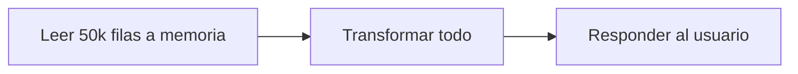

Problemas: mucha memoria, latencia alta, el usuario no ve nada hasta el final.

Con streaming (nuestra demo):

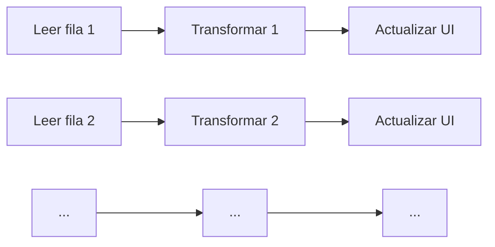

Ventajas:

- **Menor pico de memoria** (procesas en chunks).
- **Feedback inmediato** (barra de progreso, filas/s).
- **Backpressure natural**: Transform consume a la velocidad que puede; Ingest puede pausar entre chunks.

El parámetro `sleep_ms` y el **modo lento** de la UI existen solo para hacer visible este flujo en una demo en vivo.

---

## 12. Glosario rápido

| Término | Significado sencillo |
|---------|---------------------|
| **RPC** | Llamar a una función que vive en otro programa, a través de la red |
| **gRPC** | Implementación moderna de RPC con protobuf y HTTP/2 |
| **Protobuf** | Formato binario + lenguaje para definir mensajes (`.proto`) |
| **Stub** | Código generado que “simula” la función remota en el cliente |
| **Servicer** | Implementación real del servicio en el servidor |
| **Unary** | Una petición, una respuesta |
| **Client streaming** | Cliente envía secuencia; servidor responde al cerrar |
| **Server streaming** | Cliente pide una vez; servidor envía secuencia |
| **SSE** | El servidor empuja eventos al navegador por HTTP |
| **Gateway** | Puente entre el mundo web (HTTP) y el mundo gRPC (backend) |
| **Pipeline** | Cadena de servicios donde la salida de uno alimenta al siguiente |

---

## 13. Cómo experimentar y qué observar

1. Levanta el entorno: `docker compose up --build`
2. Abre http://localhost:5173
3. Activa **modo lento** y pulsa **Iniciar pipeline**
4. Observa en paralelo:
   - El diagrama pulsando en `Ingest`, luego `Transform`, luego `Gateway/UI`
   - La barra de progreso avanzando
   - El feed con previews JSON cada pocos eventos
5. (Opcional) Mira los logs: `docker compose logs -f`

Preguntas guía para profundizar:

- ¿Qué pasaría si Transform se cae a mitad del stream?
- ¿Por qué no enviamos un evento SSE por cada fila (50 000 eventos)?
- ¿Qué ventaja tiene tener Ingest y Transform en procesos separados?

---

## 14. Mapa mental final

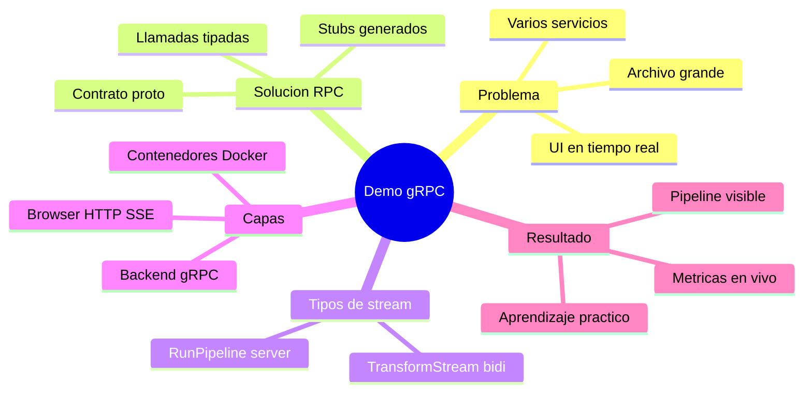

---

## 15. Siguientes pasos de aprendizaje

1. Abre [`proto/pipeline/v1/pipeline.proto`](../proto/pipeline/v1/pipeline.proto) y relaciona cada `rpc` con la secuencia del diagrama.
2. Lee [`services/ingest/server.py`](../services/ingest/server.py) — orquestador `RunPipeline` y bidi `TransformStream`.
3. Lee [`services/transform/server.py`](../services/transform/server.py) — worker que devuelve `BatchResult` por lote.
4. Lee [`services/gateway/main.py`](../services/gateway/main.py) — combina FastAPI, SSE y el servicer gRPC.
5. Modifica `chunk_size` y observa cómo cambia la cadencia de eventos en la UI (un evento SSE por lote).

---

## 16. Comparación REST vs gRPC (pestañas en la UI)

La demo incluye un **segundo stack equiparable** al gRPC: mismo patrón en el navegador (`POST /jobs` + SSE), misma orquestación en servidor y mismos eventos de progreso por `chunk_size`. La diferencia que se mide es el **protocolo interno** (HTTP JSON por lote frente a gRPC `RecordBatch` en stream).

### Arquitectura REST equiparable

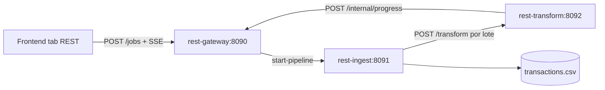

### Secuencia típica (REST)

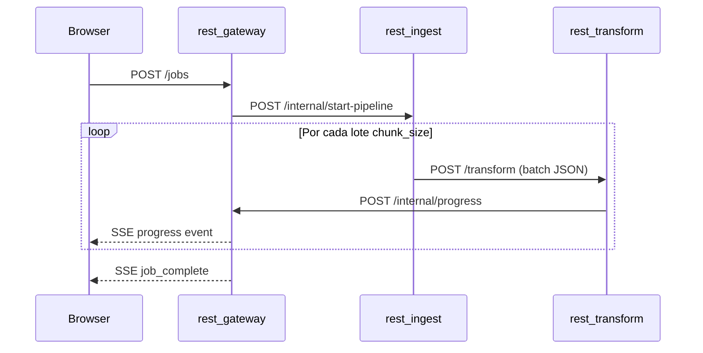

### Trade-offs esperados en la demo

| Aspecto | Pipeline gRPC | Pipeline REST equiparable |
|---------|---------------|---------------------------|
| Peticiones desde el browser | ~2 (POST + SSE) | ~2 (POST + SSE) |
| Orquestación | Backend (gateway → ingest → transform) | Backend (rest-gateway → rest-ingest → rest-transform) |
| Progreso | Push SSE (1 evento por lote) | Push SSE (1 evento por lote) |
| Comunicación interna | gRPC stream `RecordBatch` (protobuf tipado) | HTTP POST JSON por lote |
| Contrato interno | `.proto` tipado | JSON OpenAPI-style |

### Cómo usar la comparativa

1. Abre http://localhost:5173
2. Configura **chunk size** y **modo lento** (compartidos entre pestañas)
3. Ejecuta **Pipeline gRPC** → se guardan métricas
4. Cambia a **Pipeline REST** → ejecuta de nuevo
5. Revisa la **tabla comparativa** (tiempo, peticiones, bytes, filas)

Interpretación didáctica: con flujos simétricos en el browser, las diferencias reflejan sobre todo **serialización y transporte entre servicios** (protobuf binario + HTTP/2 frente a JSON en HTTP/1.1), no quién orquesta el pipeline.

---

## Referencias en este repositorio

| Recurso | Contenido |
|---------|-----------|
| [`README.md`](../README.md) | Comandos para ejecutar la demo |
| [`proto/pipeline/v1/pipeline.proto`](../proto/pipeline/v1/pipeline.proto) | Contrato gRPC |
| [`docker-compose.yml`](../docker-compose.yml) | Topología de contenedores |
| [`frontend/src/App.svelte`](../frontend/src/App.svelte) | UI con pestañas gRPC/REST y comparativa |
| [`services/rest_gateway/main.py`](../services/rest_gateway/main.py) | REST gateway: jobs, SSE, progreso interno |
| [`services/rest_ingest/main.py`](../services/rest_ingest/main.py) | Pipeline REST: lectura CSV secuencial por lotes |
| [`services/rest_transform/main.py`](../services/rest_transform/main.py) | Transformación REST + progreso al gateway |

---

*Documento generado para acompañar la demo `rpc_demo`. Si compartes esta guía en una charla, recomendamos proyectar el diagrama de secuencia (sección 6) mientras ejecutas la demo en vivo.*

**Documentación técnica (mantenimiento):** [DESCRIPCION_TECNICA.md](DESCRIPCION_TECNICA.md)
